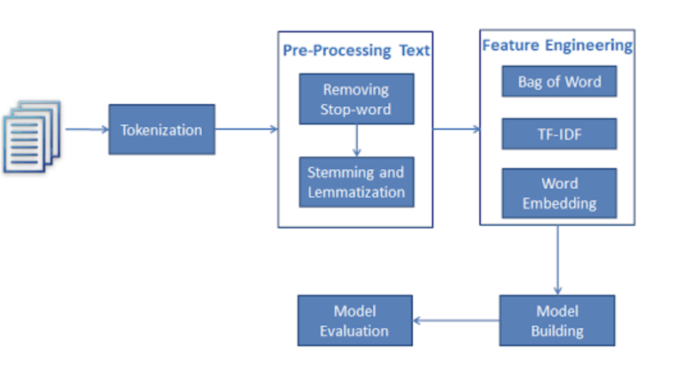
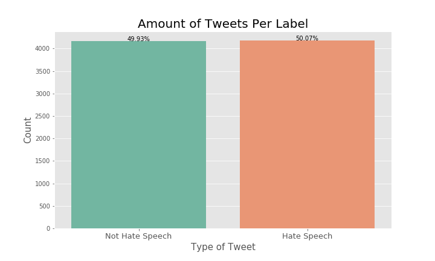
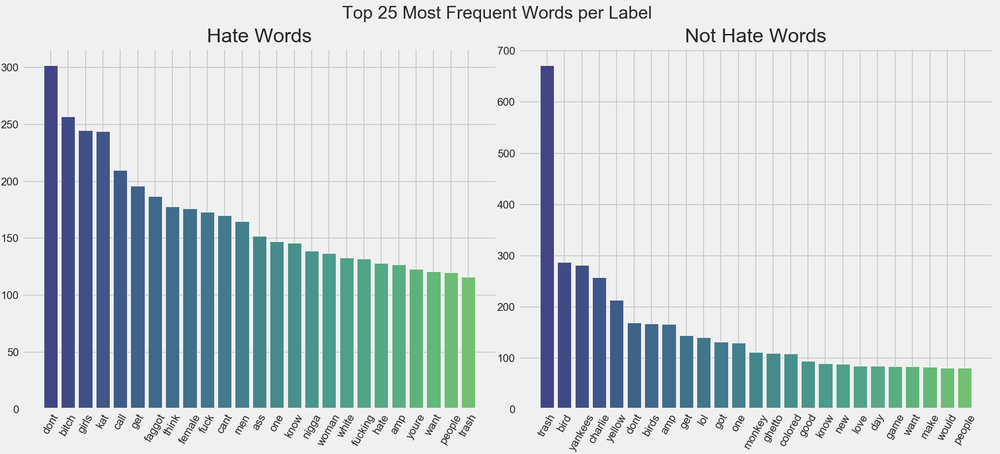
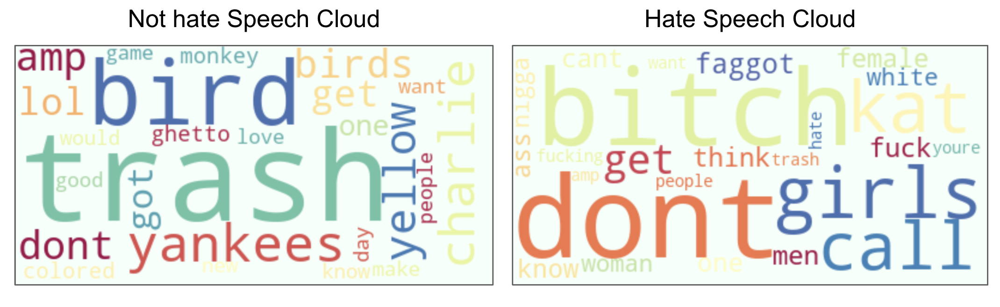
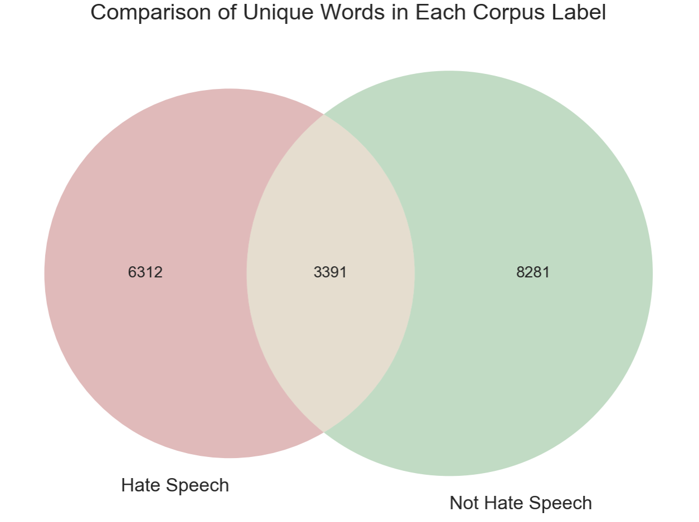
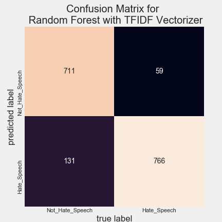

# Sentiment Analysis on Twitter. Hate Speech recognition

## Overview

Main goal of this project is to create a mode that will be able to identify hate speech using machine learning binary classification algorithms.
Random Forest, Naive Bayes, Logistic Regression algorithms used to create baseline models. 
The final model was a Random Forest that used TfidfVectorizer for feature engineering. It produced an F1 of 0.8 and Recall (TPR) of 0.93.

## Business Problem
In our modern world we have freedom in sharing our thoughts, beliefs, criticizing other people and commenting their thoughts on different social media. It became possible also due to growing democracy both in the structure of different countries and in the use of social networks and the dissemination of people’s opinions through them.
Moreover, some individuals feel that it is natural to use hate speech with regard to other people on social media, but it is not respectful and polite towards persons who get this comments or who can simply notice this text with inappropriate vocabulary during scrolling other tweets. We can identify hate speech as injurious or undermining speech that communicates preference against a specific cluster, particularly on the premise of race, religion or sexual orientation.

Surprisingly, most of the social media platforms still don’t have moderate speech instruments which can automatically identify and correct hate speech or ban it and prevent the text with it from being published.

## Approach

General Approach for this problem was based on Cross Industry Standard Process for Data Mining (CRISP-DM)
Which includes all following impotrtant steps: 

1. Look at the big picture. 
2. Get the data. 
3. Discover and visualize the data to gain insights. 
4. Prepare the data for Machine Learning algorithms. 
5. Select a model and train it. 
6. Fine-tune your model. 
7. Present your solution. 
8. Launch, monitor, and maintain system.

    
    
## Methodology

Based on our business problem we are trying to accomplish certain tasks that involve natural language. NLP allows computers to interact with text data in a structured and sensible way. With NLP, computers are taught to understand human language, its meaning and sentiments. In order to translate complex natural human language into systematic constructed features we need to follow some major steps which showed on the next graph.

    

## Analysis

Data for this project was sourced from a study about Automated Hate Speech Detection and the Problem of Offensive Language conducted by team of Cornell University in 2017. Additional data sources from Association for Computational Linguistics provide us labeled data with tweets ID's that contain hate speech. Links to data sources can be found in references below.

During EDA we discovered that data from Cornell University appears to be unbalanced with minority class as hate speech and represented on the left side of the graph. With API requests using labeled as hate speech tweets ids we were able to bring more data to our project and balance it. Left side of the graph shows balanced data.
 

 
After appropriate Pre-Processing that include Tokenization, Removing Stop-words and Cleaning Data we were able to generate frequency distribution of words within the whole corpus. It helped to understand data better and explained to us what kind of additional cleaning needs to be done before turning data into a Document-Term Matrix. Graph below shows the 25 most frequent words that we were able to find in each class that belong to the main corpus.

    

With the WordCloud library we were able to create bags of most important words in each class. We also observed that both classes had lots of the same words that were located in the corpus of our data. Because of the similarities of each label’s vocabulary, it could be difficult for machine learning algorithms to differentiate between them and determine what counts as hate speech.

    

With further analysis we were able to find out and create vocabulary of only words that belong to tweets labeled as hate speech. We found 6312 words that exclusively belong to tweets labeled as hate speech. Majority of hate speech words are racist, sexist and homophobic slurs that exceed cultural slang. The fact that these words are unique to the "Hate Speech" label affirm that it's indeed hate speech that should be flagged and taken down.

    

Graph above represents a venn diagram that shows how many unique words belong to each class and how many words show up in both classes. 3391 words showing up in both classes which makes it difficult for machine learning models to predict the correct label on particular tweets.
After futers engineering with TF-IDF Vectorization the next step takes place for creating models and evaluating them.

## Modeling

F1 score and Recall was used as main evaluation metrics for this project. We want to classify correct hate speech as much as possible and so that it can be efficiently removed. 
Starting with baseline models, Random Forest, Naive Bayes, Logistic Regression was applied to imbalanced data. Best result was shown by Random Forest Model with Recall = 12% and F1-score = 19%

Next step was to run the same 3 models on balanced data. Following table shows the performance of each model on the test set.

    
 
Based on results, the highest Recall and F-1 score achieved with Random Forest and Naive Bayes classifier. Following step was to use GridSearch with a Random Forest classifier to get the best parameters in order to achieve a higher Recall score. Random Forest with Hyper Parameters selected with GridSearch let us create final model with following results on testing data: 
Precision: 0.7124
Recall: 0.937
Testing Accuracy: 0.7816
F1 Score: 0.8094

The Confusion Matrix below explains the high True Positive rate. In this business context, we would ideally want as many True Positives as possible, because that would be identifying Hate Speech correctly.

    

## Conclusion
The final model performance was achieved through balancing data with additional tweets labeled as hate speech. 
The biggest part of the project has been done with Exploratory Data Analyses. It showed specific insides of the data. 
Final model was created with Random Forest Classifier and selection of the best parameters from GridSearch.
Hate speech detection is an extremely difficult task for Machine Learning because of the nuances in English slang and slurs. 
This project shows that we were able to create a system that can provide content moderation with pretty good results.

## Future Work

One of the further steps will be to expand this project for multi classification problems. For example, we can classify other types of tweets like offensive speech. Also we can evaluate model with new tweets or other online forum data to see if it can generalize well.

## Repository Structure

    ├── README.md                    # The top-level README for reviewers of this project
    ├── data                         # CSV files obtained trough API request
    ├── utils.py                     # py file with functions for ingeniring and modeling
    ├── images                       # Both sourced externally and generated from Code       
    ├── Final_Notebook.ipynb         # Notebook that goes over out modling process"                                       
    └── notebooks                    # notebooks for project
    
    

**References:**  

- Davidson, T., Warmsley, D., Macy, M. and Weber, I., 2017. Automated Hate Speech Detection and the Problem of Offensive Language \[Data file\]. ArXiv. Retrieved from:  https://github.com/t-davidson/hate-speech-and-offensive-language. (Publication: https://arxiv.org/pdf/1703.04009.pdf)

- Waseem, Z., Hovy, D. (2016). Hateful Symbols or Hateful People? Predictive Features for Hate Speech Detection on Twitter \[Data file\]. In: *Proceedings of the NAACL Student Research Workshop*. San Diego, Calfornia: Association for Computational Linguistics, pages 88-93. Retrieved from: https://github.com/ZeerakW/hatespeech.  (Publication:  https://www.aclweb.org/anthology/N16-2013.pdf)

**Contact Information:**  
[Ivan Zakharchuk](https://github.com/vanitoz) 
[Steven Yan](https://github.com/examsherpa) 

